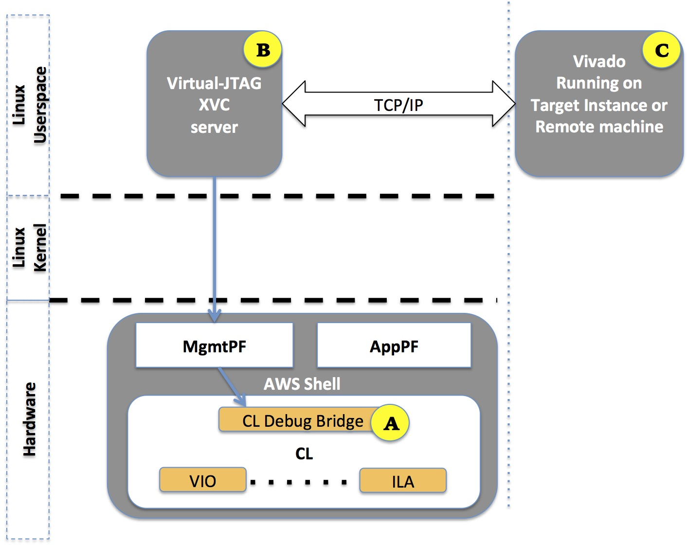

# Virtual JTAG for Real-time FPGA Debug

## Table of Content

1. [Overview](#overview)  

2. [Embedding Debug Cores in CL/AFI](#embeddingDebugCores)  

3. [Enabling Debug on FPGA-enabled EC2 Instance, using XVC](#startVJtag)

4. [Connecting Vivado to The Debug Target FPGA-enabled EC2 Instance](#connectToTarget)

5. [Frequently Asked Questions](#faq)


# Overview <a name="overview"></a>

EC2 FPGA platforms supports Virtual JTAG capability, by emulating JTAG over PCIe. 

To take advantage of this capability, [AWS FPGA Management Tools](../../sdk/user/fpga_management_tools/README.md) enables running an in-target service (in Linux userspace), implementing Xilinx Virtual Cable (XVC) protocol, which allows (local or remote) Vivado to connect to target FPGA for debug leveraging standard Xilinx debug cores like ILA, VIO, and others. 

XVC on top of AWS Virtual JTAG allows similar debug flow to what traditionally used actual JTAG to connect to a physical FPGA, to perform debug through Vivado to perform the debug. 

There are three main components which enable XVC debug an AWS FPGA enabled instances like F1, shown in the following figure:  

- **[A]** [Debug cores](#embeddingDebugCores) like CL Debug Bridge, Xilinx ILA, VIO, etc., inside the FPGA CustomLogic (CL) portion.  

- **[B]** [Virtual-JTAG service](#startVJtag) acting as XVC Server, running on target F1 instance (or any other EC2 instance with Xilinx FPGA).  

-	**[C]** [(Local or Remote) Vivado](#connectToTarget) application for interactive debug.

  
  
  

# Embedding Debug Cores in CL <a name="embeddingDebugCores"></a>

The Custom Logic (CL) is required to include the [CL Debug Bridge](../common/shell_latest/TBD) provided by AWS as part of the HDK, and any required standard Xilinx debug IP components like ILAs and VIOs. 

The following list describes the steps to successfully setup debug in a CL where debug is required:  

**Step 1:**	CL Debug Bridge must be instanciated at top-level of the CL, and the nets connecting to the CL Debug Bridge must have the same as the port names of the CL Debug Bridge, except the clock. The clock to the CL Debug Bridge should be one of the 8 input CL clocks. When the net names are correct, these nets connect should automatically to the top level of the CL. The below code snippet shows the instance fthe CL Debug Bridge.

```
cl_debug_bridge CL_DEBUG_BRIDGE (
      .clk(clk_main_a0),
      .drck(drck),
      .shift(shift),
      .tdi(tdi),	
      .update(update),
      .sel(sel),
      .tdo(tdo),
      .tms(tms),
      .tck(tck),
      .runtest(runtest),
      .reset(reset),
      .capture(capture),
      .bscanid(bscanid)
   );
```  
  
  
**Step 2:**	To instance Xilinx' [Integrated Logic Analyzer (ILA)](https://www.xilinx.com/products/intellectual-property/ila.html). An ILA IP should be created using Vivado IP Catalog and it should be customized according to the desired probes. The ILA can be instanced at any level in the hierarchy inside the CL and the nets requiring debug have to be connected probe input ports of the ILA. The clock to the ILA should be the same clock of the clock domain to which the nets under debug belong to. A separate ILA is required for nets belonging to different clock domains. (Please see section “Suggested Background” for more details).

**Step 3:**	To instance Xilinx' [Virtual Input/Output (VIO)](https://www.xilinx.com/products/intellectual-property/vio.html). A VIO IP should be created using Vivado IP Catalog and it should be customized as desired. The VIO can be instanced at any level in the hierarchy inside the CL and the input/output nets should be connected as desired. The clock to the VIO should be the same clock of the clock domain to which the VIO output/input probe signals belong to. A separate VIO is required for different clock domains. Please see section [Suggested Background](#suggestios) for more details.

**Step 4:**	Xilinx Vivado implementation tools perform the connections and wiring between the debug IP components (ILAs/VIOs) and the CL Debug Bridge. Care should be taken to set `set_param chipscope.enablePRFlow true` in the tcl command during synthesis and implementation. This is automatically included if AWS CL Build scripts are delivered with this HDK.


# Starting Virtual JTAG (XVC) Debug Server on the Target FPGA-enabled EC2 Instance <a name="startVJtag"></a>

To start debugging a given FPGA slot, which has the [CL debug cores](#embeddingDebugCores), the developer need to call FPGA Management Tool `$ fpga-start-virtual-jtag` from Linux shell. This management tool starts Xilinx's Virtual Cable (XVC) service for a given FPGA slot, listening to a given TCP port.

``` 
$ sudo fpga-start-virtual-jtag -?
  SYNOPSIS
      fpga-start-virtual-jtag [GENERAL OPTIONS] [-h]
      Example: fpga-start-virtual-jtag -S 0 [-P <tcp-port>]
  DESCRIPTION
      Start Virtual JTAG spplication server, running Xilinx's Virtual
      Cable (XVC) service,  which listens incoming command over TCP
      port that is set by -P option (Default TCP port is 10201).
      The fpga-image-slot parameter is a logical index that represents
      a given FPGA within an instance.
      This command will work only if AFI is in READY state:
      Use fpga-describe-local-image to return the FPGA image status, and
      fpga-describe-local-image-slots to return the AFI state.
      The AFI should have included Xilinx's VIO/LIA debug cores
      and AWS CL Debug Bridge inside the CustomLogic (CL)
      Concurrent debug of multiple FPGA slots is possible as long as
      different <tcp-port> values are used for each slot.
      Linux firewall and/or EC2 Network Security Group rules may
      need to change for enabling inbound access to the TCP port.
  GENERAL OPTIONS
      -S, --fpga-image-slot
          The logical slot number for the FPGA image
          Constraints: Positive integer from 0 to the total slots minus 1.
      -P, --tcp-port
          The TCP port number to use for virtual jtag server, default
          TCP port is 10201.  Remember to use different TCP port for
          different slot if debugging multiple slots concurrently
      -?, --help
          Display this help.
      -H, --headers
          Display column headers.
      -V, --version
          Display version number of this program.
```

  
# Connecting Vivado to the Debug Target FPGA-enabled EC2 Instance <a name="connectToTarget"></a>

TBD


# Frequently Asked Questions <a name="faq"></a>
  
  
  
**Q: Do I need to run Vivado on target EC2 instance to debug?**  
  
  
**Q: How do I configure Linux firewalls and EC2 network security groups to enable remote debug?**
 
 
**Q: Can I have a secure connection (i.e. SSL/TLS) to the target FPGA-enable EC2 Instance running Virtual JTAG service?**

 
**Q: Do I need Vivado license to use Virtual JTAG and Xilinx' VIO / LIA debug capabilities?**
  
  
  
**Q: How do I stop the Virtual JTAG service on the target instance?**
  
  
  
**Q: Can I debug multiple FPGAs on same target EC2 instance concurrently?**
